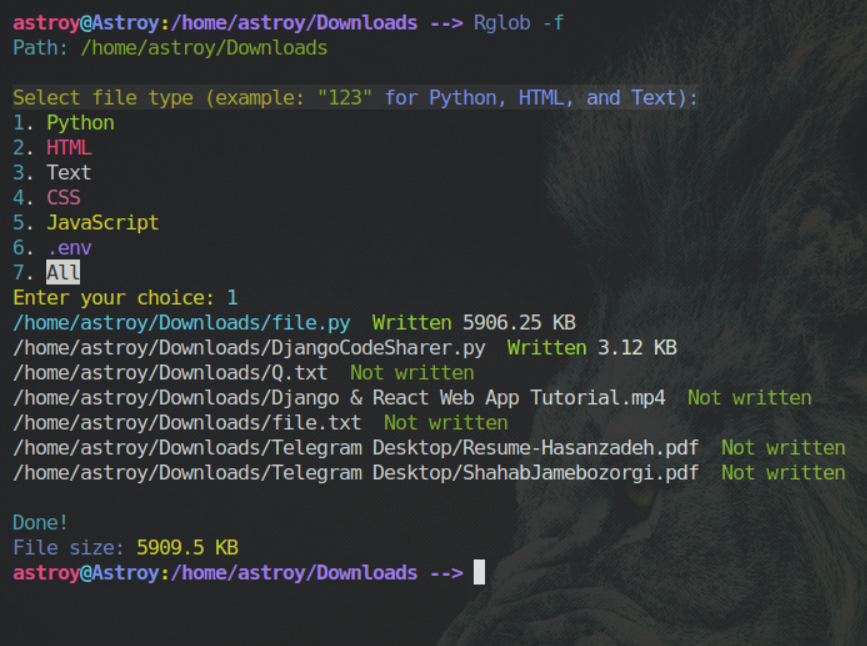

# DjangoProjectExporter

A simple tool for Django developers to extract project files into a single text file, ideal for sharing with AI for development assistance.
i think it is very useful for who are just started to learn django, and want help from Ai, but they have no time , for copy paste all text in each file for Ai!

A better way to use this tool is, put it in a folder, and create an alias from it in your system, to access it easly
```bash
alias Export 'python ~/Downloads/DjangoCodeSharer.py'
```

## Example


<br>

## Features
- Extracts project files to `file.txt` in the folder that this code exists.
- Supports multiple file formats (`Python`, `Html`,`Text`, `CSS`, `JavaScript`, `.env`) with `-f` flag.
- Allows specifying a project folder path.
- Colorful CLI interface using `colorama`.

## Installation
Install the required module:
```bash
pip install colorama
```

## Usage
```bash
python DjangoCodeSharer.py [path] [-f]
```

or when u are in base project directory, and also you have set an alias by the name `Django_export`:

```bash
Django_export
```

and done!! no more command needed
in this way by default, it write this formats:
- `.py`
- `.html` & `.htm`
- `.env`


## More Complete Manual:
- `[path]`: Project folder path (optional). Defaults to current directory (`.`).  
  Example: `python DjangoCodeSharer.py ./my_django_project`
- `-f`: Enables file format selection. Choose formats by entering numbers:  
  - `1`: `.py` (Python)  
  - `2`: `.html` or `.htm` (HTML)  
  - `3`: `.txt` (Text)  
  - `4`: `.css` (CSS)  
  - `5`: `.js` (JavaScript)
  - `6`: `.env` (Environment File)
  - `7`: All formats above  
  Example: Enter `123` to select just: `Python`, `HTML`, and `Text`.

### With `-f` Flag:
```bash
python DjangoCodeSharer.py ./my_project -f
```
- Prompts for format selection (e.g., `123`).  
- Only selected file types (e.g., `.py`, `.html`, `.txt`) are processed.

### Without `-f` Flag:
If `-f` is not used, only the following files are processed by default:  
- `.py` (Python)  
- `.html` and `.htm` (HTML)
- `.env`

### Example Without `-f`:
```bash
python django_project_exporter.py ./my_project
```

## Output
- Selected files and their contents are saved to `file.txt`in the folder that this code is.  
- File details (size and status) are displayed in the console.

example:

```txt
/home/astroy/Downloads/index.py  Written 5906.25 KB
/home/astroy/Downloads/Notes.txt  Not written
```


## Requirements
- Python 3.6 or higher
- `colorama` module
